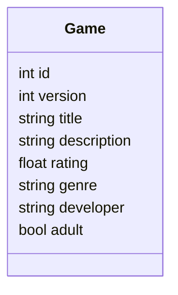

## Serverless REST Assignment - Distributed Systems.

__Name:__ Jordon Coady

__Demo:__ ... link to your YouTube video demonstration ......

### Context.

I choose to use game collections as my context. Every game belongs to a series of games i.e., Gears of war 1, Gears of war 2, Gears of war 3 belong to the same series or collection.

- id: This is the partion key and signfies which games belong to the same series or collection.
- version: This specfies the current version of the game.
- title: This is the sort key, every value assigned to this attribute will be unique. No game will share the same name.
- description: Provides a brief description of the game.
- rating: metacritic rating for the game.
- genre: what is the genre of the game.
- developer: What company made the game.
- adult: Is the game rated 18's or not.

### App API endpoints.

- Protected
+ POST /games - Add a new game 
+ PUT /games - Update an existing game 

- Public 
+ GET /games/{gameId} - Retrieve a game collection by gameId.
+ GET /games/{gameId}?title=value - Retrieve a game collection then filter them by game title.
+ GET /games/{gameId}?title=value&language=value - Retrieve a game collection then filter them by game title and translate returned item by specfied language.
+ GET /games - Retrieve all games in the database.

### Update constraint (if relevant).

- When a user adds a game their principalId is stored in the database with the item as an extra attribute.
- When a user tries to update an item a check is done to see if the principalId stored in the item matches the user trying to update that item. 

### Translation persistence (if relevant).

- When the URL matches exactly with /games/{gameId}?title=value&language=value only then will a translation occur. I did this way to avoid excssive translations i.e., not translation entire collection just an item from a collection.

- I created a translation table, the partition key is title and the sort key is language. So, when the above URL condition is met, a getCommand is sent to the translation table to see if that item has been translated and if it's been translated in the specfied language. i.e., check if title and language is present.

- If it hasn't been translated, pass the item and language to a function which will loop through each attribute and check if the type is string, if it is, use the TranslateTextCommand to translate it and store it as the new attribute value. if it isn't keep the original value. The function will return the translated item.

- Then the translated item will be stored in the translation table using the PutCommand, with the added attribute of language.

###  Extra (If relevant).

[ State whether you have created a multi-stack solution for this assignment or used lambda layers to speed up update deployments. Also, mention any aspect of the CDK framework __that was not covered in the lectures that you used in this assignment. ]

